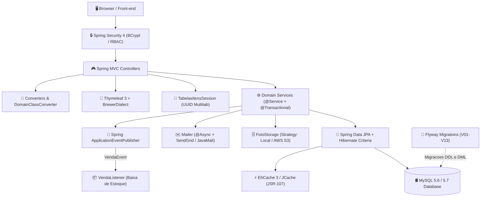

# 🍺 Brewer - Sistema de Gestão e Vendas de Cerveja

[](https://travis-ci.org/rfaguiar/spring-mvc-brewer)
[](https://sonarcloud.io/dashboard?id=com.brewer%3Abrewer)
[](https://sonarcloud.io/component_measures?id=com.brewer%3Abrewer&metric=coverage)
[](https://hub.docker.com/r/rfaguiar/brewer)

> **Uma aplicação web corporativa de referência com Spring Framework 5, arquitetura em camadas, microsserviços auxiliares, infraestrutura moderna (Docker, Kubernetes e OpenShift) e design patterns para engenheiros de software.**

---

## 📖 Resumo do Projeto e Propósito

O **Brewer** é uma plataforma completa para cadastro, controle de estoque, precificação, gestão de clientes e emissão de pedidos de venda de cervejas artesanais e importadas.

Mais do que um sistema funcional, o **Brewer** foi projetado para servir como um **catálogo vivo e guia prático de engenharia de software corporativo**. Ele reúne soluções arquiteturais robustas para desafios cotidianos do desenvolvimento back-end e DevOps:

- **Configuração 100% Java (Zero `web.xml`)** sob especificação Servlet 3.1.
- **Transações e Persistência Avançada** com Spring Data JPA, Hibernate Criteria dinâmico e queries SQL nativas mapeadas para DTOs.
- **Desacoplamento Orientado a Eventos (Event-Driven)** com Spring Application Events para baixa de estoque.
- **Processamento Assíncrono (`@Async`)** para envio de e-mails transacionais em segundo plano.
- **Estratégia de Armazenamento Pluggable (Strategy Pattern)** alternando entre disco local e **AWS S3**.
- **Isolamento de Carrinho por Aba do Navegador** usando tabelas de sessão indexadas por UUIDs.
- **Dialeto Próprio no Thymeleaf 3** para componentes reutilizáveis de interface.
- **Infraestrutura Pronta para Produção**: Docker Multi-Stage, Docker Compose, manifestos **Kubernetes** (Minikube com Ingress) e **Red Hat OpenShift** (DeploymentConfig, Secrets e Routes), todos orquestrados por **Makefile**.

---

## 🧭 Índice da Documentação Detalhada (`docs/`)

Toda a documentação técnica aprofundada está organizada e disponível na pasta [`docs/`](docs/):

| Documento | Descrição do Conteúdo |
| :--- | :--- |
| 🏛️ [**Arquitetura do Sistema**](docs/arquitetura.md) | Diagramas de fluxo, camadas, design patterns (Strategy, Observer, Builder, DTO, Entity Listener) e ciclo de vida. |
| 🚢 [**Infraestrutura, Docker, K8s e OpenShift**](docs/infraestrutura-e-deploy.md) | Dockerfile multi-stage, Docker Compose, manifests Kubernetes (Minikube), OpenShift e Makefile detalhado. |
| 📚 [**Catálogo de Tecnologias e Padrões**](docs/catalogo-tecnologias.md) | Guia de consulta rápida com exemplos de código: Spring MVC, Security, JPA, Flyway, EhCache, AWS S3, etc. |
| 💼 [**Funcionalidades e Regras de Negócio**](docs/funcionalidades-e-regras-de-negocio.md) | Regras funcionais: cervejas, clientes PF/PJ, combo dinâmico, carrinho multitab, workflow de venda e dashboards. |
| 🚀 [**Guia de Execução Local e Configuração**](docs/guia-execucao-e-configuracao.md) | Passo a passo de setup, compilação Maven, MySQL, migrations Flyway, variáveis de ambiente e remote debug. |
| 🧪 [**Testes, Qualidade e CI/CD**](docs/testes-e-qualidade.md) | Pirâmide de testes, Test Data Builders, Mockito, PowerMock, H2 In-Memory, Travis CI e SonarCloud. |

---

## 🏛️ Conceitos Arquiteturais



- **Separação Rígida de Camadas**: Controller -> Service -> Repository -> Database.
- **Estratégia de Multi-Ambiente (`@Profile`)**:
  - `local`: Desenvolvimento em máquina local com conexão direta MySQL e storage em `$HOME/.brewerfotos`.
  - `local-jndi`: Execução em Tomcat com DataSource configurado via JNDI.
  - `docker-desenv`: Containers isolados com URLs e credenciais injetadas por variáveis de ambiente.
  - `prod`: Nuvem / Kubernetes / OpenShift com AWS S3, SendGrid e credenciais externas seguras.
- Veja detalhes completos em [**docs/arquitetura.md**](docs/arquitetura.md).

---

## 📂 Estrutura do Projeto

```
spring-mvc-brewer/
├── docs/                               # 📚 Documentação completa e aprofundada
│   ├── arquitetura.md
│   ├── catalogo-tecnologias.md
│   ├── funcionalidades-e-regras-de-negocio.md
│   ├── guia-execucao-e-configuracao.md
│   ├── infraestrutura-e-deploy.md
│   └── testes-e-qualidade.md
├── kubernetes/                         # ☸️ Manifestos Kubernetes (Namespace: dev-to)
│   ├── app/                            # Deployment, Service e Ingress da aplicação
│   └── mysql/                          # Deployment e Service do MySQL
├── openshift/                          # 🔴 Manifestos Red Hat OpenShift (DeploymentConfig, Route, Service)
├── tomcat8/                            # 🐱 Configurações do Apache Tomcat (tomcat-users.xml)
├── Dockerfile                          # 🐳 Multi-stage build (Maven 3.3 JDK 8 -> Tomcat 8 JRE 8)
├── docker-compose.yml                  # 🐙 Orquestração local de containers
├── Makefile                            # 🛠️ Automação de tarefas (build, docker, minikube, openshift)
├── pom.xml                             # 📦 Configuração de dependências e plugins Maven
└── src/
    ├── main/
    │   ├── java/com/brewer/
    │   │   ├── config/                 # Configurações Spring (JPA, Web, Security, Mail, S3, Init)
    │   │   ├── controller/             # Controladores Spring MVC, Converters e Handlers
    │   │   ├── dto/                    # Objetos de Transferência de Dados
    │   │   ├── mail/                   # Serviço de envio de e-mails assíncronos
    │   │   ├── model/                  # Entidades de Domínio JPA
    │   │   ├── repository/             # Repositórios Spring Data e Queries Criteria/Nativas
    │   │   ├── security/               # UserDetailsService e autenticação customizada
    │   │   ├── service/                # Regras de negócio e ouvintes de eventos
    │   │   ├── session/                # Gestão de carrinhos por aba (UUID)
    │   │   ├── storage/                # Estratégia de armazenamento (Local e AWS S3)
    │   │   ├── thymeleaf/              # Dialeto customizado e processadores de tags/atributos
    │   │   └── validation/             # Anotações e validadores customizados (@SKU, @AtributoConfirmacao)
    │   └── resources/
    │       ├── cache/                  # Configuração do EhCache 3 (ehcache.xml)
    │       ├── db/migration/           # Scripts SQL versionados do Flyway (V01 a V13)
    │       ├── env/                    # Configurações de properties por ambiente
    │       ├── sql/                    # Named Native Queries em XML (consultas-nativas.xml)
    │       ├── static/                 # CSS, JavaScripts customizados e vendors
    │       └── templates/              # Páginas Thymeleaf, layouts e templates Handlebars (hbs/)
    └── test/                           # 🧪 Suíte de mais de 44 classes de testes automatizados e Builders
```

---

## 🛠️ Catálogo Tecnológico e Padrões (Consulta Rápida)

Para facilitar o uso como catálogo de referência no dia a dia, consulte abaixo as tecnologias implementadas e os arquivos de exemplo no código:

| Tecnologia / Conceito | Versão | Propósito / Padrão de Engenharia | Arquivo de Exemplo no Projeto |
| :--- | :--- | :--- | :--- |
| **Spring Web MVC** | 5.0.2 | MVC Controller, Binding, Flash Attributes, `@Valid` | [`CervejasController.java`](src/main/java/com/brewer/controller/CervejasController.java) |
| **DomainClassConverter** | 5.0.2 | Conversão automática do ID na URL diretamente para a entidade JPA | [`WebConfig.java`](src/main/java/com/brewer/config/WebConfig.java) |
| **Spring Security** | 4.1.1 | RBAC, BCrypt, Method Security (`@PreAuthorize`), Single Session | [`SecurityConfig.java`](src/main/java/com/brewer/config/SecurityConfig.java) |
| **Spring Data JPA** | 1.11.23 | Repositórios tipados mesclados com Custom Implementations | [`CervejasImpl.java`](src/main/java/com/brewer/repository/helper/cerveja/CervejasImpl.java) |
| **Hibernate Criteria** | 5.1.0 | Filtros e paginações dinâmicas seguras no banco de dados | [`VendasImpl.java`](src/main/java/com/brewer/repository/helper/venda/VendasImpl.java) |
| **JPA Entity Listener** | 2.1 | Injeção de dependência e pré-carregamento dinâmico via `@PostLoad` | [`CervejaEntityListener.java`](src/main/java/com/brewer/repository/listener/CervejaEntityListener.java) |
| **Native SQL & DTOs** | XML 2.1 | Subconsultas analíticas agregadas mapeadas para construtor de DTO | [`consultas-nativas.xml`](src/main/resources/sql/consultas-nativas.xml) |
| **Flyway DB Migrations** | 4.0.2 | Versionamento automatizado de schema e dados de banco (V01-V13) | [`db/migration/`](src/main/resources/db/migration) |
| **EhCache 3 / JCache** | 3.4.0 | Cache em memória JSR-107 com `@Cacheable` e `@CacheEvict` | [`ehcache.xml`](src/main/resources/cache/ehcache.xml) |
| **AWS SDK S3** | 1.10.77 | Upload e gestão de objetos na nuvem com controle de ACL | [`FotoStorageS3.java`](src/main/java/com/brewer/storage/s3/FotoStorageS3.java) |
| **Thumbnailator** | 0.4.8 | Redimensionamento e geração de thumbnails de fotos em tempo real | [`FotoStorageLocal.java`](src/main/java/com/brewer/storage/local/FotoStorageLocal.java) |
| **JavaMail & SendGrid** | 1.5.6 | Envio assíncrono (`@Async`) de e-mails HTML com imagens inline CID | [`Mailer.java`](src/main/java/com/brewer/mail/Mailer.java) |
| **Custom Thymeleaf Dialect**| 3.0.1 | Criação de tags HTML próprias (`<brewer:message>`, `<brewer:pagination>`) | [`BrewerDialect.java`](src/main/java/com/brewer/thymeleaf/BrewerDialect.java) |
| **Custom Bean Validation** | 5.2.4 | Validações em nível de classe (`@AtributoConfirmacao`) e regex (`@SKU`) | [`AtributoConfirmacaoValidator.java`](src/main/java/com/brewer/validation/validator/AtributoConfirmacaoValidator.java) |
| **Session Isolation por Aba**| Servlet | Carrinho de compras isolado por aba através de hash UUID do cliente | [`TabelasItensSession.java`](src/main/java/com/brewer/session/TabelasItensSession.java) |
| **Test Data Builders** | - | Fluência e padronização na instanciação de massas de testes | [`CervejaBuilder.java`](src/test/java/com/brewer/builder/CervejaBuilder.java) |

- Consulte todos os detalhes e exemplos práticos em [**docs/catalogo-tecnologias.md**](docs/catalogo-tecnologias.md).

---

## 💼 Funcionalidades do Sistema

1. **Gestão de Cervejas**: Cadastro completo com SKU validado, seleção de estilo com cadastro rápido via modal AJAX, teor alcoólico, comissão, preço, controle de estoque e upload assíncrono de foto com preview e fallback para mock.
2. **Gestão de Clientes**: Suporte a Pessoa Física (CPF) e Jurídica (CNPJ) com máscara reativa; combo de estados e cidades cascateado com cache; busca rápida de clientes em janela modal.
3. **Ponto de Venda (PDV) e Vendas**: Inclusão de itens via autocomplete, cálculo automático de frete/desconto/total em memória; emissão de venda com baixa automática de estoque via eventos de domínio e envio de e-mail com resumo da compra.
4. **Cancelamento Controlado**: Cancelamento seguro de vendas com validação de permissão SpEL (`#venda.usuario == principal.usuario or hasRole('CANCELAR_VENDA')`).
5. **Painel Dashboard**: Indicadores de vendas no mês, vendas no ano, ticket médio, valor total do estoque e gráficos interativos com Chart.js.
6. **Segurança e Usuários**: Gestão de usuários, associação a grupos de acesso, e ativação/desativação em lote via barra flutuante.
- Veja todas as regras de negócio em [**docs/funcionalidades-e-regras-de-negocio.md**](docs/funcionalidades-e-regras-de-negocio.md).

---

## ⚡ Guia Rápido de Execução Local

### Opção 1: Execução Imediata via Docker Compose (Recomendado)
```bash
# Subir aplicação e banco de dados
docker-compose up -d

# Visualizar status
docker-compose ps

# Acompanhar logs
docker-compose logs --tail="all" --follow

# Parar serviços
docker-compose down
```
> Acesse no navegador: `http://localhost:8080`

---

### Opção 2: Execução com Maven e Tomcat Embutido (Webapp Runner)
1. **Configurar o Banco MySQL**:
   ```bash
   # Conectar no MySQL
   mysql -u root -p -h 127.0.0.1 -P 3306

   # Criar o banco
   CREATE DATABASE brewer DEFAULT CHARACTER SET utf8 DEFAULT COLLATE utf8_general_ci;
   ```
2. **Executar Migrações do Flyway**:
   ```bash
   mvn -Dflyway.user=root -Dflyway.password=root -Dflyway.url=jdbc:mysql://localhost:3306/brewer?useSSL=false flyway:migrate
   ```
3. **Compilar a Aplicação**:
   ```bash
   mvn clean package -Plocal
   ```
4. **Executar com Webapp Runner**:
   ```bash
   java $JAVA_OPTS -Dspring.profiles.active=local -jar target/dependency/webapp-runner.jar target/brewer.war --port 8080
   ```

---

### Opção 3: Automação via Makefile
```bash
make help          # Exibe todas as regras disponíveis
make run-db        # Sobe o MySQL no Docker
make build-app     # Compila a aplicação com Maven
make run-app       # Roda a aplicação conectada ao MySQL
```

---

## ☸️ Orquestração com Kubernetes (Minikube) e OpenShift

### Minikube (Automação completa via Makefile):
```bash
make k-all         # Inicializa cluster, sobe MySQL, compila imagem e implanta aplicação
```
- Acesso configurado via Ingress no host: `http://dev.brewer.local`
- Manifestos disponíveis em [`kubernetes/`](kubernetes).

### Red Hat OpenShift:
```bash
make oc-deploy-app # Aplica os manifestos na plataforma OpenShift
```
- Manifestos com `DeploymentConfig`, `Route` e `Service` disponíveis em [`openshift/`](openshift).

---

## 🔑 Credenciais Padrão de Acesso

Após a execução das migrações do Flyway, o sistema inicializa com o seguinte usuário administrador:

| Informação | Valor |
| :--- | :--- |
| **URL de Acesso** | `http://localhost:8080/login` |
| **E-mail** | `admin@brewer.com` |
| **Senha** | `admin` |
| **Permissões** | Acesso completo a todos os módulos e cancelamento de vendas |

---

## 🐛 Depuração Remota (Remote Debugging)

O Tomcat na imagem Docker roda com suporte JPDA ativo na porta `8000`:
- **Porta**: `8000`
- **Transporte**: `dt_socket`
- Conecte sua IDE favorita (IntelliJ IDEA / Eclipse / VS Code) via configuração **Remote JVM Debug** para debugar a aplicação em tempo real dentro do contêiner!

---

## 🧪 Qualidade de Código e Testes

Execute a suíte de testes com cobertura de código:
```bash
mvn clean test
```
- Mais de 44 classes de testes cobrindo Controllers, Services, Repositories, Validadores e Regras de Sessão.
- Para detalhes sobre os Builders e pipeline de CI/CD, consulte [**docs/testes-e-qualidade.md**](docs/testes-e-qualidade.md).
