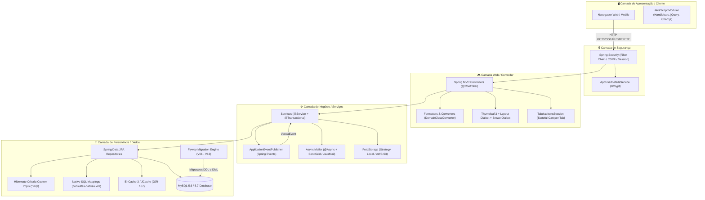
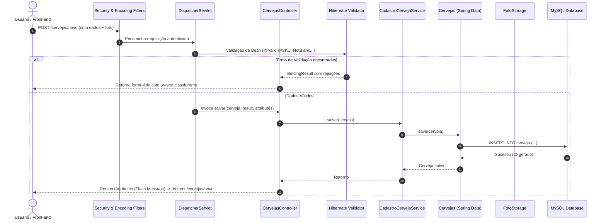
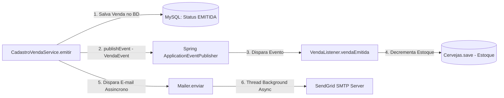

# 🏛️ Arquitetura do Sistema - Spring MVC Brewer

Este documento descreve a arquitetura geral, os padrões de projeto adotados, o fluxo de dados e os princípios de engenharia de software empregados no **Brewer**.

---

## 1. Visão Geral da Arquitetura

O **Brewer** foi projetado seguindo o padrão clássico em camadas (**Layered Architecture**), fortemente desacoplado, utilizando o ecossistema Spring Framework 5 em uma aplicação web corporativa padrão Servlet 3.1 (sem necessidade de arquivo `web.xml`, 100% configurado via código Java com `WebApplicationInitializer`).

### 📊 Diagrama Arquitetural de Alto Nível



---

## 2. Padrões de Projeto (Design Patterns) Aplicados

| Padrão de Projeto | Onde é Aplicado no Projeto | Benefício e Propósito |
| :--- | :--- | :--- |
| **Strategy Pattern** | [`FotoStorage`](../src/main/java/com/brewer/storage/FotoStorage.java) com implementações [`FotoStorageLocal`](../src/main/java/com/brewer/storage/local/FotoStorageLocal.java) e [`FotoStorageS3`](../src/main/java/com/brewer/storage/s3/FotoStorageS3.java) | Permite alternar transparente e dinamicamente o armazenamento de imagens entre o disco local (desenvolvimento) e o Amazon S3 (produção) via `@Profile`. |
| **Observer / Event-Driven** | [`ApplicationEventPublisher`](../src/main/java/com/brewer/service/CadastroVendaService.java), [`VendaEvent`](../src/main/java/com/brewer/service/event/venda/VendaEvent.java) e [`VendaListener`](../src/main/java/com/brewer/service/event/venda/VendaListener.java) | Desacopla a emissão da venda da atualização de estoque das cervejas vendidas. |
| **Builder Pattern** | Pacote [`com.brewer.builder`](../src/test/java/com/brewer/builder) nos testes unitários e de integração | Facilita a criação de entidades de teste ricas, consistentes e com defaults inteligentes, eliminando código boilerplate nos testes. |
| **Data Transfer Object (DTO)** | Pacote [`com.brewer.dto`](../src/main/java/com/brewer/dto) ([`CervejaDTO`](../src/main/java/com/brewer/dto/CervejaDTO.java), [`VendaMes`](../src/main/java/com/brewer/dto/VendaMes.java), [`ValorItensEstoque`](../src/main/java/com/brewer/dto/ValorItensEstoque.java)) | Transporta dados consolidados entre queries nativas/APIs REST e o front-end sem expor ou onerar as entidades JPA gerenciadas. |
| **Custom Dialect / Processor** | [`BrewerDialect`](../src/main/java/com/brewer/thymeleaf/BrewerDialect.java) e processadores de tag/atributo | Extensão do motor Thymeleaf para encapsular marcações repetitivas de paginação, ordenação de tabelas e formatação de erros em tags limpas como `<brewer:message/>`. |
| **Decorator / Wrapper** | [`PageWrapper`](../src/main/java/com/brewer/controller/page/PageWrapper.java) | Envolve o objeto `Page` do Spring Data JPA com métodos utilitários para paginação e ordenação com URL dinâmica no Thymeleaf. |
| **Entity Listener (JPA Callback)** | [`CervejaEntityListener`](../src/main/java/com/brewer/repository/listener/CervejaEntityListener.java) | Intercepta o ciclo de vida da entidade com `@PostLoad` para preencher automaticamente URLs públicas e de thumbnails a partir do serviço de Storage ativo. |

---

## 3. Inicialização e Configuração Spring (Sem `web.xml`)

A aplicação adota o padrão Servlet 3.0+ com inicialização 100% baseada em anotações:

1. **[`AppInitializer`](../src/main/java/com/brewer/config/init/AppInitializer.java)**:
   - Estende `AbstractAnnotationConfigDispatcherServletInitializer`.
   - Registra as classes de contexto raiz (**Root Config**): [`JPAConfig`](../src/main/java/com/brewer/config/JPAConfig.java), [`ServiceConfig`](../src/main/java/com/brewer/config/ServiceConfig.java), [`SecurityConfig`](../src/main/java/com/brewer/config/SecurityConfig.java), [`S3Config`](../src/main/java/com/brewer/config/S3Config.java).
   - Registra as classes de servlet (**Servlet Config**): [`WebConfig`](../src/main/java/com/brewer/config/WebConfig.java), [`MailConfig`](../src/main/java/com/brewer/config/MailConfig.java).
   - Mapeia o DispatcherServlet na raiz (`/`).
   - Registra o filtro `HttpPutFormContentFilter` para dar suporte a verbos HTTP PUT/DELETE em formulários HTML.
   - Configura o perfil padrão de execução como `local`:
     ```java
     servletContext.setInitParameter("spring.profiles.default", "local");
     ```
   - Configura o suporte a multipart para upload de arquivos via `MultipartConfigElement`.

2. **[`SecurityInitializer`](../src/main/java/com/brewer/config/init/SecurityInitializer.java)**:
   - Estende `AbstractSecurityWebApplicationInitializer`.
   - Registra o filtro de segurança do Spring Security antes do DispatcherServlet.
   - Configura explicitamente o `SessionTrackingMode` como `COOKIE`.
   - Adiciona o `CharacterEncodingFilter` forçando a codificação `UTF-8` em todas as requisições.

---

## 4. Gestão de Perfis de Ambiente (Spring Profiles)

O projeto implementa separação estrita de ambientes via `@Profile`:

| Perfil (`spring.profiles.active`) | Finalidade | Configuração de Banco de Dados | Storage de Fotos | Provedor de E-mail |
| :--- | :--- | :--- | :--- | :--- |
| **`local`** (Padrão) | Desenvolvimento em máquina local | Conexão direta JDBC (`jdbc:mysql://localhost:3306/brewer`) via `BasicDataSource` | Disco local (`$HOME/.brewerfotos`) | SendGrid via properties `env/mail-local.properties` |
| **`local-jndi`** | Servidor Tomcat com DataSource via JNDI | JNDI Lookup (`jdbc/brewerDB`) via `JndiDataSourceLookup` | Disco local (`$HOME/.brewerfotos`) | Arquivo de properties externo |
| **`docker-desenv`** | Execução isolada em containers Docker | JDBC dinâmico via variáveis de ambiente (`JDBC_URL`, `JDBC_USER`, `JDBC_PASS`) | Disco local no container (`$HOME/.brewerfotos`) | Variáveis de ambiente / properties |
| **`prod`** | Produção em Kubernetes, OpenShift ou Cloud | Parser de URI de conexão (`JAWSDB_URL`) | Amazon Web Services (AWS S3) via SDK | SendGrid via variáveis de ambiente (`SEND_GRID_USERNAME`, `SEND_GRID_PASSWORD`) |

---

## 5. Fluxo de Requisições e Ciclo de Vida da Aplicação



---

## 6. Arquitetura de Eventos e Assincronismo

### Emissão de Vendas e Desacoplamento do Estoque
Quando uma venda é emitida, o serviço de domínio não deve travar o processo principal com tarefas que podem ser processadas em reação ao evento:



1. **Baixa de Estoque**: [`CadastroVendaService.java`](../src/main/java/com/brewer/service/CadastroVendaService.java) publica [`VendaEvent`](../src/main/java/com/brewer/service/event/venda/VendaEvent.java). O ouvinte [`VendaListener.java`](../src/main/java/com/brewer/service/event/venda/VendaListener.java) intercepta e subtrai as quantidades de cada cerveja no estoque.
2. **E-mail Transacional em Segundo Plano**: O [`Mailer.java`](../src/main/java/com/brewer/mail/Mailer.java) utiliza a anotação `@Async` (habilitada globalmente em [`WebConfig.java`](../src/main/java/com/brewer/config/WebConfig.java) via `@EnableAsync`), montando um e-mail HTML rico com Thymeleaf e enviando sem reter a thread da requisição HTTP do usuário.

---

## 7. Decisões Arquiteturais Relevantes (ADRs Resumidas)

1. **Uso de Java Configuration em vez de XML**: Maior segurança de tipos (*type safety*), facilidade de refatoração pelo compilador e clareza na injeção de dependências.
2. **Flyway para Versionamento de Schema**: O banco de dados evolui de forma reproduzível e rastreável, evitando comandos manuais de criação de tabelas.
3. **Mapeamento de Consultas Complexas via XML**: Queries analíticas com agregações pesadas e subconsultas (`Vendas.totalPorMes`, `Vendas.porOrigem`) são isoladas em [`consultas-nativas.xml`](../src/main/resources/sql/consultas-nativas.xml) para manter o código Java limpo e mapear diretamente para DTOs via `SqlResultSetMapping`.
4. **Isolamento de Carrinho por Aba do Navegador**: O carrinho de compras não é armazenado em uma sessão global única compartilhada por abas, mas sim gerenciado por uma tabela hash UUID por aba (`tabelaHash`), permitindo que o mesmo usuário manipule múltiplas vendas em abas concorrentes sem corrupção de estado.
