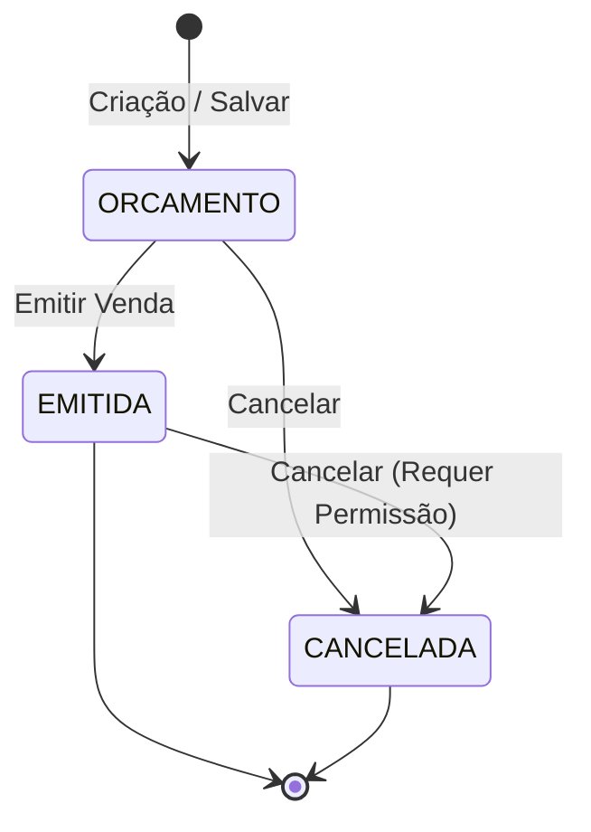

# 💼 Funcionalidades e Regras de Negócio

Este documento apresenta detalhadamente todos os **módulos de negócio**, funcionalidades e regras implementadas no **Brewer**.

---

## 1. Módulo de Cervejas e Estilos

### 1.1 Cadastro e Manutenção de Cervejas
- **Campos Obrigatórios**:
  - **SKU**: Código alfanumérico identificador único validado pela anotação customizada [`@SKU`](../src/main/java/com/brewer/validation/SKU.java) (formato de 2 letras seguido de 4 dígitos, ex: `AA1234`).
  - **Nome**: Descrição comercial da cerveja (até 80 caracteres).
  - **Estilo**: Associação obrigatória com um registro da tabela `estilo`.
  - **Sabor**: Enumerador ([`Sabor.java`](../src/main/java/com/brewer/model/Sabor.java)): `ADOCICADA`, `AMARGA`, `FORTE`, `FRUTADA`, `SUAVE`.
  - **Teor Alcoólico**: Valor decimal percentual formatado (ex: `5,50%`).
  - **Origem**: Enumerador ([`Origem.java`](../src/main/java/com/brewer/model/Origem.java)): `NACIONAL` ou `INTERNACIONAL`.
  - **Preço / Valor**: Valor monetário em Reais (`BigDecimal`), formatado para o padrão brasileiro (`#,##0.00`).
  - **Comissão**: Percentual de comissão do vendedor sobre o item.
  - **Estoque**: Quantidade inicial de itens disponíveis.

### 1.2 Gestão de Imagens e Mock Fallback
- **Upload Assíncrono**: O upload da foto é feito via AJAX utilizando o componente de upload do UIKit.
- **Prévia Instantânea**: O template Handlebars [`hbs/FotoCerveja.html`](../src/main/resources/templates/hbs/FotoCerveja.html) renderiza a foto na tela assim que o upload é concluído no backend.
- **Mock Fallback**: Se uma cerveja for cadastrada sem foto, o sistema associa automaticamente a imagem padrão [`cerveja-mock.png`](../src/main/resources/static/images/cerveja-mock.png).

### 1.3 Cadastro Rápido de Estilo via Modal AJAX
- Durante o cadastro de uma nova cerveja, se o estilo desejado não existir, o usuário clica no botão `+` ao lado do combo.
- Um modal Bootstrap se abre e submete o novo estilo via AJAX sem recarregar a página ([`estilo.cadastro-rapido.js`](../src/main/resources/static/javascripts/estilo.cadastro-rapido.js)).
- Após a inserção, o novo estilo é adicionado diretamente ao combo e selecionado automaticamente.

### 1.4 Pesquisa Avançada e Paginação
- Filtros combinados por: SKU, Nome, Estilo, Sabor, Origem, Valor De / Até.
- Ordenação dinâmica por colunas através da tag customizada `<brewer:order/>`.
- Paginação inteligente via [`PageWrapper.java`](../src/main/java/com/brewer/controller/page/PageWrapper.java) e tag `<brewer:pagination/>`.

---

## 2. Módulo de Clientes e Localidades

### 2.1 Suporte a Pessoa Física e Jurídica
- **Tipo de Pessoa**: Enumerador ([`TipoPessoa.java`](../src/main/java/com/brewer/model/TipoPessoa.java)):
  - `FISICA`: exige CPF com máscara `000.000.000-00` e validação de tamanho (11 dígitos).
  - `JURIDICA`: exige CNPJ com máscara `00.000.000/0000-00` e validação de tamanho (14 dígitos).
- **Troca Dinâmica de Máscara**: O script [`cliente.mascara-cpf-cnpj.js`](../src/main/resources/static/javascripts/cliente.mascara-cpf-cnpj.js) altera o placeholder e a máscara do input em tempo real conforme o radio button selecionado.
- **Unicidade de Documento**: O serviço [`CadastroClienteService.java`](../src/main/java/com/brewer/service/CadastroClienteService.java) garante que não existam dois clientes com o mesmo CPF ou CNPJ cadastrados.

### 2.2 Combo Cascata de Estado e Cidade com Caching
- A seleção de um Estado no dropdown dispara uma requisição AJAX para `/cidades?estado={codigo}`.
- O resultado é armazenado em memória com **EhCache 3** (`@Cacheable(value = "cidades")`), evitando consultas repetidas ao banco de dados MySQL para os mesmos estados.
- Caso o usuário cadastre uma nova cidade, a anotação `@CacheEvict` limpa a entrada correspondente daquele estado no cache.

### 2.3 Pesquisa Rápida de Clientes em Vendas
- Na tela de vendas, o botão de lupa abre uma janela modal de busca rápida ([`PesquisaRapidaClientes.html`](../src/main/resources/templates/cliente/PesquisaRapidaClientes.html)).
- A listagem é renderizada dinamicamente com o template Handlebars [`TabelaPesquisaRapidaClientes.html`](../src/main/resources/templates/hbs/TabelaPesquisaRapidaClientes.html).
- O duplo clique sobre a linha do cliente preenche automaticamente os dados do comprador na venda ativa.

---

## 3. Módulo de Vendas e PDV (Ponto de Venda)

### 3.1 Ciclo de Vida da Venda

1. **Orçamento (`StatusVenda.ORCAMENTO`)**:
   - Venda em rascunho. Os itens estão reservados apenas logicamente na venda, sem decrementar o estoque da cerveja.
2. **Emitida (`StatusVenda.EMITIDA`)**:
   - Venda finalizada com sucesso.
   - Dispara [`VendaEvent`](../src/main/java/com/brewer/service/event/venda/VendaEvent.java) via `ApplicationEventPublisher`.
   - O ouvinte [`VendaListener`](../src/main/java/com/brewer/service/event/venda/VendaListener.java) decrementa automaticamente as quantidades de cada item do estoque da respectiva cerveja no banco.
   - Dispara envio de e-mail assíncrono para o cliente contendo o resumo completo da compra e imagens inline dos produtos.
3. **Cancelada (`StatusVenda.CANCELADA`)**:
   - Venda anulada.
   - **Regra de Segurança**: Implementada com `@PreAuthorize("#venda.usuario == principal.usuario or hasRole('CANCELAR_VENDA')")`. Apenas o vendedor proprietário da venda ou um administrador com o papel `CANCELAR_VENDA` pode cancelar uma venda emitida.

### 3.2 Carrinho de Compras Multitab (Sessão Isolada por UUID)
- Cada aba de navegador aberta na criação de venda gera um identificador único `tabelaHash` (UUID).
- Todas as operações de adicionar item, alterar quantidade e remover item são enviadas junto com o `tabelaHash`.
- Isso possibilita abrir múltiplas vendas em paralelo sem misturar itens entre abas!

---

## 4. Módulo de Dashboard e Analytics

O painel de controle principal ([`DashboardController.java`](../src/main/java/com/brewer/controller/DashboardController.java)) consolida dados estratégicos para a gestão:

### 4.1 Indicadores de Desempenho (KPI Cards)
- **Vendas no Mês**: Soma total de vendas emitidas no mês vigente (`Vendas.valorTotalNoMes`).
- **Vendas no Ano**: Faturamento acumulado no ano atual (`Vendas.valorTotalNoAno`).
- **Ticket Médio no Ano**: Média de valor por venda emitida no ano (`Vendas.valorTicketMedioNoAno`).
- **Valor dos Itens em Estoque**: Valor financeiro total imobilizado e contagem total de unidades em estoque (`Cervejas.valorItensEstoque`).
- **Total de Clientes**: Contagem de clientes registrados na base.

### 4.2 Gráficos Dinâmicos (Chart.js)
1. **Total de Vendas por Mês (Últimos 6 meses)**:
   - Endpoint REST: `/vendas/totalPorMes`.
   - Consulta SQL nativa com mapeamento para [`VendaMes.java`](../src/main/java/com/brewer/dto/VendaMes.java).
   - Renderiza gráfico de linha mostrando a evolução mês a mês com preenchimento automático para meses sem movimento.
2. **Vendas por Origem (Nacional vs Internacional)**:
   - Endpoint REST: `/vendas/porOrigem`.
   - Consulta nativa com agrupamento por mês e nacionalidade da cerveja ([`VendaOrigem.java`](../src/main/java/com/brewer/dto/VendaOrigem.java)).
   - Renderiza gráfico de barras comparando a preferência do consumidor entre rótulos nacionais e importados.

---

## 5. Módulo de Segurança e Controle de Acessos

### 5.1 Hierarquia de Permissões
O modelo RBAC (Role-Based Access Control) é estruturado nas tabelas:
- `usuario` -> `usuario_grupo` -> `grupo` -> `grupo_permissao` -> `permissao`.

#### Grupos Padrão Cadastrados no Flyway (`V09__inserir_grupos.sql`):
- **Administrador**: Possui todas as permissões do sistema (`CADASTRAR_CIDADE`, `CADASTRAR_USUARIO`, `CANCELAR_VENDA`).
- **Vendedor**: Possui acesso restrito a vendas, clientes e emissão de orçamentos.

### 5.2 Ativação e Desativação em Lote de Usuários
- Na listagem de usuários, a barra flutuante [`multiselecao.js`](../src/main/resources/static/javascripts/multiselecao.js) é ativada ao marcar checkboxes de um ou mais usuários.
- O botão `Ativar` ou `Desativar` submete uma requisição PUT em lote para `/usuarios/status` atualizando o status booleano `ativo` no banco de dados.
