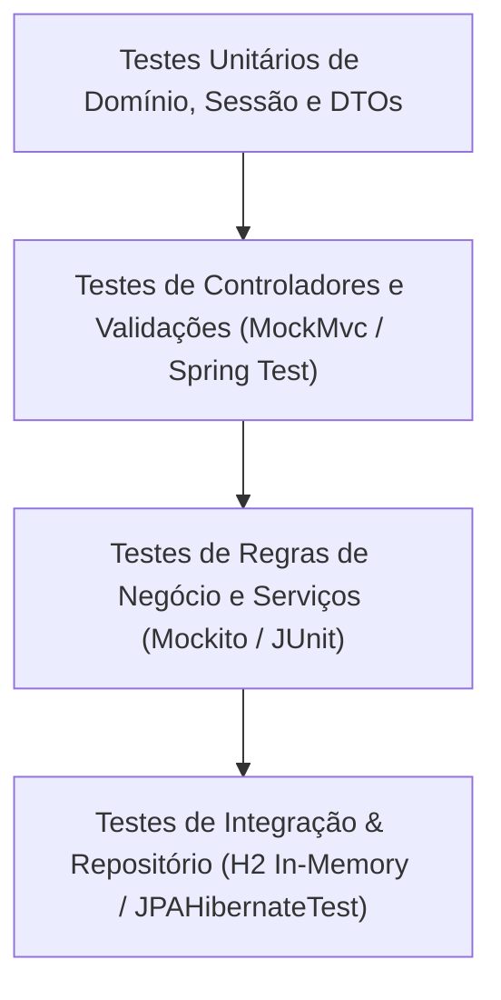

# 🧪 Estratégia de Testes, Qualidade de Código e CI/CD

Este documento descreve as práticas de teste automatizado, design de testes com **Test Data Builders**, cobertura e integração contínua (CI/CD) adotadas no projeto **Brewer**.

---

## 1. Pirâmide e Estrutura de Testes

O projeto conta com mais de **44 classes de testes automatizados**, cobrindo todas as camadas da aplicação:



---

## 2. Padrão Test Data Builder

No pacote [`src/test/java/com/brewer/builder/`](../src/test/java/com/brewer/builder), o projeto implementa o padrão **Test Data Builder** para cada uma das entidades e DTOs do sistema.

### 2.1 Por que usar Test Data Builders?
1. **Elimina Boilerplate**: Evita instanciar objetos com dezenas de setters repetitivos em cada teste.
2. **Defaults Válidos**: O builder inicializa a entidade com um estado válido por padrão. O desenvolvedor sobrescreve apenas os atributos relevantes para o cenário do teste específico.
3. **Fluência e Expressividade**: O teste se torna legível como uma especificação de comportamento.

### 2.2 Exemplo Prático: `CervejaBuilder`

```java
public class CervejaBuilder {
    private Cerveja cerveja;

    public static CervejaBuilder criar() {
        CervejaBuilder builder = new CervejaBuilder();
        builder.cerveja = new Cerveja();
        builder.cerveja.setCodigo(1L);
        builder.cerveja.setSku("AA1234");
        builder.cerveja.setNome("Cerveja Teste");
        builder.cerveja.setDescricao("Descrição padrão para teste");
        builder.cerveja.setValor(new BigDecimal("10.00"));
        builder.cerveja.setTeorAlcoolico(new BigDecimal("5.0"));
        builder.cerveja.setComissao(new BigDecimal("10.0"));
        builder.cerveja.setQuantidadeEstoque(100);
        builder.cerveja.setOrigem(Origem.NACIONAL);
        builder.cerveja.setSabor(Sabor.SUAVE);
        builder.cerveja.setEstilo(EstiloBuilder.criar().build());
        return builder;
    }

    public CervejaBuilder comEstoque(Integer quantidade) {
        this.cerveja.setQuantidadeEstoque(quantidade);
        return this;
    }

    public CervejaBuilder comValor(BigDecimal valor) {
        this.cerveja.setValor(valor);
        return this;
    }

    public Cerveja build() {
        return this.cerveja;
    }
}
```

### 2.3 Uso no Teste:
```java
// Criando uma cerveja com estoque esgotado para testar regra de falta de estoque
Cerveja cervejaSemEstoque = CervejaBuilder.criar().comEstoque(0).build();
```

---

## 3. Testes de Camadas Específicas

### 3.1 Testes de Regra de Negócio e Serviços
- **Exemplo**: [`CadastroVendaServiceTest.java`](../src/test/java/com/brewer/service/CadastroVendaServiceTest.java)
- Testa transações de venda, transições de status (`ORCAMENTO` -> `EMITIDA`), publicação de eventos e validação de permissões com `@PreAuthorize`.

### 3.2 Testes de Eventos Assíncronos
- **Exemplo**: [`VendaListenerTest.java`](../src/test/java/com/brewer/service/event/venda/VendaListenerTest.java)
- Valida se o disparo de `VendaEvent` invoca corretamente a subtração de estoque no repositório de cervejas.

### 3.3 Testes de Isolamento de Sessão
- **Exemplo**: [`TabelasItensSessionTest.java`](../src/test/java/com/brewer/session/TabelasItensSessionTest.java)
- Garante que itens inseridos na aba com UUID `hash1` não aparecem na aba com UUID `hash2`.

### 3.4 Testes de Validações Customizadas
- **Exemplo**: [`AtributoConfirmacaoValidatorTest.java`](../src/test/java/com/brewer/validation/validator/AtributoConfirmacaoValidatorTest.java)
- Testa o validador com combinações de senhas coincidentes, diferentes e campos nulos.

---

## 4. Pipeline de CI/CD e Qualidade de Código

### 4.1 Travis CI ([`.travis.yml`](../.travis.yml))
A cada push ou pull request, o pipeline executa automaticamente:
1. Provisionamento do ambiente OpenJDK 8.
2. Cache local do diretório `.m2` para acelerar builds subsequentes.
3. Compilação e execução de toda a suíte de testes.
4. Análise estática de código com **SonarCloud**:
   ```bash
   mvn clean org.jacoco:jacoco-maven-plugin:prepare-agent install sonar:sonar -Dsonar.organization=rfaguiar-github
   ```

### 4.2 SonarCloud Quality Gate
O projeto monitora continuamente métricas de qualidade:
- **Code Smells e Dívida Técnica**
- **Vulnerabilidades de Segurança**
- **Cobertura de Código por Testes Automatizados**
- **Duplicações de Código**
